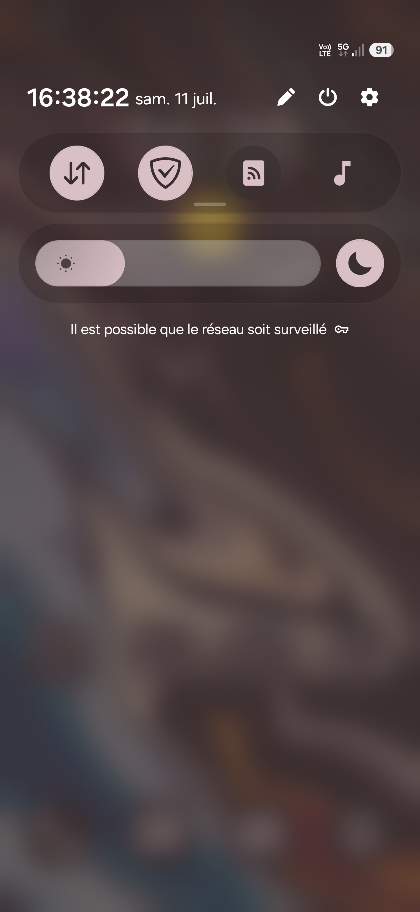
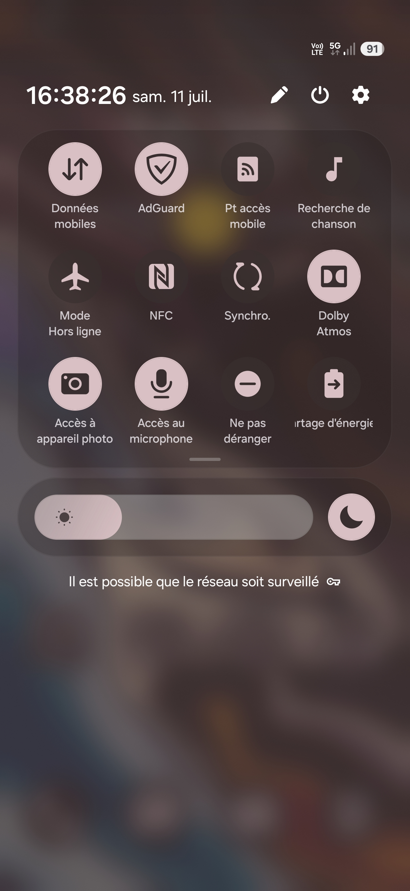

 

**The Ruvomain Manifesto**

• **Why:** `Sovereignty over convenience.`

• **How:** `Minimalist, modular, non-intrusive interventions.`

• **Status:** `Stable for [Samsung S24+ Series] / Tested on [Android 16 OneUI 8.5].`

I started this project out of pure necessity. My S24+(Exynos) was constantly running hot and draining battery in standby, despite having 'optimized' settings enabled. I realized that standard user-facing settings are just a facade, the real battery consumption happens behind the scenes, buried in system telemetry and background services.
After 15+ years of tinkering with custom ROMs, I decided to pivot my approach. Instead of flashing a custom OS, I wanted to see how far I could push the stock firmware to its absolute limits of efficiency without breaking Knox or banking apps. This repository is my personal log, my testing ground, and the documentation of my journey to reclaiming my hardware sovereignty.
This hasn't been a linear process. You’ll find notes here on things that went wrong—apps I broke, services that caused bootloops, and configurations that actually increased CPU load instead of reducing it.

Links:
[Reddit](https://www.reddit.com/r/Ruvomain/s/9HlpNjl2M7)
[Telegram](t.me/ruvomain)

### Table of Contents
- [Ruvomain Protocol](https://github.com/Ruvyrom/Ruvomain-Protocole/tree/main#ruvomain-protocol)
- [Key results](https://github.com/Ruvyrom/Ruvomain-Protocole/tree/main#-key-results-one-ui-85)
- [Philosophy](https://github.com/Ruvyrom/Ruvomain-Protocole/tree/main#--philosophy)
- [Protocol hierarchy](https://github.com/Ruvyrom/Ruvomain-Protocole/tree/main#-protocol-hierarchy)
- [Package List](https://github.com/Ruvyrom/Ruvomain-Protocole/blob/main/Docs/package-list.md)
- [Network & Resource Confinement Layers](https://github.com/Ruvyrom/Ruvomain-Protocole/tree/main#%EF%B8%8F-network--resource-confinement-layers)
- [Quick start](https://github.com/Ruvyrom/Ruvomain-Protocole/tree/main#%EF%B8%8F-quick-start)
     > [Methode 1: Shizuku/Canta (Manual Control)](https://github.com/Ruvyrom/Ruvomain-Protocole/tree/main#-methode-1-via-shizuku-and-canta) 

   > [Methode 2 : ADB/Termux scripts](https://github.com/Ruvyrom/Ruvomain-Protocole/tree/main#-methode-2-via-adb-or-termux): 
- **Ruvomain Automated (CLI)**
     > [For Linux and Termux]([https://github.com/Ruvyrom/Ruvomain-Protocole/tree/main#1-for-linux-and-termux](https://github.com/Ruvyrom/Ruvomain-Protocole/tree/main#1-ruvomain-automated-cli))
- **Manual execution:**
     > [(Linux/Termux/macOS)](https://github.com/Ruvyrom/Ruvomain-Protocole/tree/main#-for-linux-users),
- [Safety & Auditing](https://github.com/Ruvyrom/Ruvomain-Protocole/tree/main#%EF%B8%8F-safety--auditing)
- [Monitoring Strategy](https://github.com/Ruvyrom/Ruvomain-Protocole/tree/main#%EF%B8%8F-monitoring-strategy)
- [Proof of concept](https://github.com/Ruvyrom/Ruvomain-Protocole/tree/main#-proof-of-concept)
- [Interface](https://github.com/Ruvyrom/Ruvomain-Protocole/tree/main#-interface)
- [Current Status](https://github.com/Ruvyrom/Ruvomain-Protocole/tree/main#-current-status)
- [Disclaimer](https://github.com/Ruvyrom/Ruvomain-Protocole/tree/main#%EF%B8%8F-disclaimer)
- [Community & Credits](https://github.com/Ruvyrom/Ruvomain-Protocole/tree/main#-community--credits)
- [License](https://github.com/Ruvyrom/Ruvomain-Protocole/blob/main/LICENSE)

# Ruvomain Protocol
**The Industrialized Approach to Android Performance & Privacy.**

The Ruvomain Protocol is a modular, audited, and reproducible architecture designed to maximize hardware efficiency for the Samsung Galaxy S24+ (Exynos 2400) without root access. By eliminating non-essential telemetry and background bloatware, we achieve true "Deep Sleep" states, elite thermal management, and 11h+ SOT.

### Why this approach?
*Some ask: "Why a protocol instead of just a simple list?"*

**Ruvomain is built for sustainability, not one-off use.** Unlike static lists that break with every OS update, Ruvomain uses a modular JSON-based architecture. This ensures **safe, consistent, and maintainable optimization** that evolves with your device—so you don't have to rebuild your debloat list from scratch every time Samsung pushes an update.

---
## 🚀 Key Results (One UI 8.5)
*   **SoT:** **11h+** on a single charge.
*   **Idle Drain:** **~0.0%/h** (Near-zero).
*   **Performance:** AnTuTu v11 **~2.1M** (Top 5%).
*   **Thermals:** Stable **~37°C** under mixed load.
*   **Knox Integrity:** **100% Safe** (No root, no bootloader unlocking).

---
## 💡  Philosophy
The conventional approach to "debloating" (manually running random ADB commands) is obsolete. It lacks consistency and is impossible to maintain. **The Ruvomain Protocol** shifts this paradigm by treating system optimization as an **industrialized engineering process**.

We don't "trick" the system; we curate it. By surgically removing non-essential services while maintaining framework stability, we ensure the device performs at its peak potential.

---
## 📦 Protocol Hierarchy
The protocol is modular, allowing users to choose their level of optimization. *Tierslists are provided as standardized defaults, but the architecture is designed for you to edit `tier*.json` files to fit your specific operational requirements.*

| Tier | Strategy| Recommended For |
|:---|:---|:---|
| **Tier 1 (Stable/Conservative)** | Redundancy & Telemetry | All users seeking immediate gains. |
| **Tier 2 (Advanced/Balanced)** | AI Telemetry & Cloud Bloat | Users prioritizing privacy & efficiency. |
| **Tier 3 (Surgical/Extreme)** | Ghost Mode (System Core) | Advanced users building a bare-metal experience. |

The protocol keep `Samsung Camera` and `gallery`, `Dolby Atmos`, `Samsung Screenshot`, `OneUI launcher`.
For privacy, you can block internet connexion (with firewall) for these apps without problem.

**For view packages list and descriptions see the /docs/[package-list.md](https://github.com/Ruvyrom/Ruvomain-Protocole/blob/main/Docs/package-list.md)**

**⚠️ Before use Tier3, you must read /docs/[REMPLACEMENT.md](https://github.com/Ruvyrom/Ruvomain-Protocole/blob/main/Docs/REMPLACEMENT.md)**

---
### 🛡️ Network & Resource Confinement Layers

The Ruvomain Protocol extends beyond basic package removal.
To achieve true hardware sovereignty and operational efficiency, we implement a multi-layered confinement strategy to minimize the device's external footprint:

**- NextDNS** (System-wide DNS Filtering):
Configured directly within Android’s Private DNS settings. This acts as the firstline of defense, neutralizing GAFAM telemetry, ISP-level tracking, and ad-infrastructure requests before they even exit the device.

**- AdGuard Nightly** (Granular Firewall):
Deployed for strict network enforcement. This layer restricts connectivity forapplications that do not require network access, prevents "phoning home" during standby (screen-off), and effectively isolates telemetry-heavy processes to minimize energy footprint and unauthorized background communication.

**- AppOps** (Privilege & Wakelock Management):
Enforces the Principle of Least Privilege. Beyond standard permission stripping, this layer targets system-level wakelocks and hardware sensors to ensure processes remain dormant unless explicitly required by the user. This is critical for preventing unauthorized data access (Clipboard, Sensors, Location, Biometrics) and ensuring maximum hardware idle efficiency.

*By layering these tools, the terminal is transformed from a data-leaking device into a hardened, localized system that obeys only the user's intent.*

---
## ⚙️ Quick Start
**Disconnect Samsung account before using tier 2 and 3 in script and for more privacy.**

### 📱 Methode 1: via Shizuku and Canta
1.  **Environment:** Install [Shizuku](https://shizuku.rikka.app/) and[Canta](https://samolego.github.io/Canta/).
2.  **Activate:** Enable Developer Options > Wireless Debugging. Pair Shizuku.
3.  **Deploy:** Import the preferred `.json` file from the Configs/[YOUR_MODEL](https://github.com/Ruvyrom/Ruvomain-Protocole/tree/main/Configs) folder into Canta.
4.  **Finalize:** Reboot the device.

### 💻 Methode 2: via ADB or Termux
For users seeking direct control and automation.

### 1. Ruvomain Automated (CLI)
**Quick & Automatic Execution
Execute directly in memory (no permanent installation required):**

**Note:** Ensure `curl` isinstalled (`pkg install curl` in Termux).

`bash <(curl -s https://raw.githubusercontent.com/Ruvyrom/Ruvomain-Protocole/main/Automated/Devices/S24%2B/ruvomain-automated.sh)`

or

`curl -LO https://raw.githubusercontent.com/Ruvyrom/Ruvomain-Protocole/main/Automated/Devices/S24%2B/ruvomain-automated.sh && chmod +x ruvomain-automated.sh && ./ruvomain-automated.sh`

**Key Features:**

**•Model Validation:** Automatic device detection (enforces secure deployment).

**•Dependency Management:** Automated setup of required tools (adb, jq).

**•Surgical Minimalism:** Utilizes mktemp for isolated execution. No system residue left behind.

**•Tiered Debloating:** Choice of strictness levels (Tier 1, 2, or 3) based on user requirements.

**•Auditability:** Comprehensive execution logging (ruvomain_history.log) for full transparency.

Once the process is complete, verify the operations performed by inspecting the log file: `cat ruvomain_history.log`

### 2.Manual Execution (Linux/Termux/macOS)
For local, offline-capable usage:**
### 🐧 For Linux users:
1. **Prerequisites:**
- [Platform-Tools](https://developer.android.com/tools/releases/platform-tools) installed (for PC). Or `sudo apt update && sudo apt install android-sdk-platform-tools` in terminal on Debian for exemple.
- 
- `jq` (The script will attempt an auto-install if missing).

2. **Deployment:**
- Clone the repo: `git clone https://github.com/Ruvyrom/Ruvomain-Protocole.git`
- Navigate: `cd ./Ruvomain-Protocole/ADB-Termux/devices/S24+`
- Execute:
`chmod +x ruvomain.sh && ./ruvomain.sh`

### 📱 For Termux users:

**- Install dependencies:** `pkg update && pkg install git android-tools jq2`.

**- Grant Storage Access:** `termux-setup-storage` (Accept the permission prompt)

**- Deploy:** Follow the same steps as the Linux deployment above.

### 🍎 For MacOS users:
1. Install [Homebrew](https://brew.sh/) if you haven't already.
2.Install `jq` and `adb`: `brew install jq android-platform-tools`
3. Go to `./Ruvomain-Protocole/ADB-Termux/S24+`
4. Run the script: `./ruvomain.sh`

**Key Features:**
- Automatically detects if it's running via ADB (PC) or directly on the device (Termux).

- Automatically installs `jq` if missing.

- Choose between Safe, Balanced, and Extreme debloating profiles.

- Transparent, modular, and easy to audit.

- Native support for Linux, macOS, and Termux. Works flawlessly on WSL (WindowsSubsystem for Linux). No Windows-specific dependencies required.

---
## 🛡️ Safety & Auditing
Transparency is a core pillar.

**Recommended approach:**
Instead of uninstalling, we use a "Containment Strategy":

**1.** Set your preferred FOSS keyboard (e.g., HeliBoard) as the default.

**2.** Use AppOps to revoke all permissions (Contacts, Storage, etc.) and restrict background execution for the Samsung Keyboard.

**3.** The package remains present to satisfy system dependencies but is effectively neutralized and isolated.

---
*   **Critical Safeguards:** Do **not** disable packages like `com.sec.location.nsflp2` (GPS) or `com.samsung.android.smartmirroring`(Smart View).
*   **System Integrity:** Avoid removing `com.samsung.android.lool` (Device Care). Disabling it may cause audio stuttering and erratic behavior during app transitions, as ithandles key background resource management.

*   `com.samsung.android.scpm`
SoundAlive/Audio quality issues

*   Any package containing:
`com.samsung.internal.systemui.navbar`:
Navigation issues

*   You can disable but if you want maintain Emergency Alerts, you must not disable the following packages:
`com.google.android.cellbroadcastreceiver`,
`com.google.android.cellbroadcastservice`

*   **Auditing:** Every package included in our tiers is verified for stability. Users are encouraged to inspect the lists in /docs/[package-list.md](https://github.com/Ruvyrom/Ruvomain-Protocole/blob/main/Docs/package-list.md).

---
## 🛠️ Monitoring Strategy

**1. Baseline Consumption (The Point of Origin)**

**Before any modification, you must establish your idle drain.**

>**Action:** Charge your device to 100%. Leave it in deep idle (screenoff, Wi-Fi on, SIM active) for 8 hours (overnight).

>**Measure:** Use AccuBattery.

>**Ruvomain Goal:** Target a drain rate between 0.0% and 0.2% per hour. If you exceed 0.5%, your system is polluted by active telemetry services.

**2. Wakelock Audit (Hunting the Intruders)**

**The primary enemy of battery efficiency is not activeusage; it is the CPU's inability to enter "Deep Sleep."**

>**Tool:** [AppOps](https://appops.rikka.app/) (via [Shizuku](https://shizuku.rikka.app/)).

**Procedure:**

>**1.Identify** system apps requesting the WAKE_LOCK permission.
>
>**2. Monitor** processes preventing the device from sleeping.
>
>**3.Audit:** If anon-essential system app holds active wakelocks in the background, it must be confined or neutralized according to the Protocol tiers.

**3. Network Traffic Analysis (Data Flow)**

**A sovereign system communicates only when the Architect authorizes it.**

>**Tool:** AdGuard (Filtering Log).

**Procedure:**

>**1.** Enable local filtering.
>
>**2.** Run for 1 hour under normal usage.
>
>**3. Audit:** Observe domains contacted by system apps (Samsung, Google, Facebook services).
>
>**4. Action:** If telemetry domains are detected, apply block rules via theintegrated firewall.

**4. Framework Stability (The Guardrail)**

**Never delete blindly. Verify the health ofthe system_server.**

>**Action:** After applying your configuration (Tier 1/2/3), monitor for spontaneous reboots or UI lag.
>
>**Technical Note:** If the Samsung keyboard reinstalls itself, you have compromised framework dependencies.
>
>**Remember:** Never use brute-force deletion.
Apply the "Confinement Strategy"(revoke permissions + restrict execution) rather than deletion.

**🛡️ Protocol Reminder**

**Your audit success is measured by these indicators:**

>**Thermals:** The device remains at ambient temperature during mixed usage.
>
>**SOT (Screen On Time):** A steady progression toward 11h+ (for an S24+).

>Share your results in the comments:
>
>**Model:** (e.g., S24+ S926B)
>
>**Tier applied:** (Tier 1, 2, or 3)
>
>**Idle drain(mAh/h):**
>
>**System observations:** Audit is repetition. The more you clean, the moretransparent the system becomes.

---
### 👥 Community & Credits
For support, discussions, and the latest news on the Ruvomain Protocol, join our Telegram channel:
[Reddit](https://www.reddit.com/r/Ruvomain/s/9HlpNjl2M7)
[Telegram Channel](https://t.me/ruvomain)

*   **Validation:** Rigorous cross-verification with [Willie_169](https://github.com/Willie169).
*   **Architecture:** Formal acknowledgment of the Canta workflow by [Samolego](https://samolego.github.io/Canta/).
*   **Community Testing:** Special thanks to @ric69 for empirical field-testing of Tier 1 stability.

This protocol is a living project. You can create and adapt this for other devices. 

---
### 📸 Proof of Concept
   

## 🧪 Interface:

This is the visual and functional result **Setup: Ruvomain Protocol (SamsungS24+)**

I’ve completely reimagined the One UI experience. The goal was to reachan AOSP-like level of minimalism, responsiveness, and privacy, without sacrificing the hardware-level optimizations of the S24+ or tripping Knox.

**The Architecture:**

**Launcher:** Lawnchair 15 (Customflow for maximum efficiency).

**Icons:** Lawnicons (Material You adaptive).

**UI/System:** Deep customization via Good Lock (Theme Park) for a consistent monochrome/monostyle aesthetic across QS panels, volume sliders, and settings.

**Hardening:** System-level bloat removal and telemetry isolation via the"Ruvomain Protocol" (Shizuku, Canta, AppOps).

**Network:** Adguard + Nextdns, no advertisement, no tracking, no telemetry.

**Weather:** Breezy Weather (Open-source, no telemetry).

**Keyboard:** HeliBoard (Open-source, local-only).

**Apps:** Full migration to the \*\*Fossify Suite\*\* (Phone, Messages, Gallery, Calendar, Calculator).

**Why:** By switching to the Fossify ecosystem, I've eliminated telemetry at the app level. No tracking, no background fluff, just pure functionality. The interface is now unified, silent, and incredibly responsive. Knox remains 100% intact.

**Philosophy:** This isn't just a theme; it's a workflow. By removing the intrusive Samsung services and remapping the UI, I've managed to reduce background activity to near-zero levels. The interface is now"silent," allowing for pure focus.

---
## ✅ Current Status:
Stable environment. No critical system crashes or UI stutters detected in daily driving.

## ⚠️ Disclaimer
*I am not responsible for any issues resulting from system modifications. Always perform a data backup before deployment.*

---
*My other project on github for [Google Pixel6, LineageOS Vanilla 23.2](https://github.com/Ruvyrom/Ruvyrom/tree/main)*

***Stay clean, stay fast, stay Ruvomain.*** 🚀
