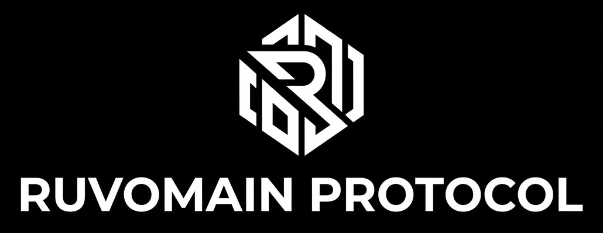

 

**The Ruvomain Manifesto**

• **Why:** `Sovereignty over convenience.`

• **How:** `Minimalist, modular, non-intrusive interventions.`

• **Status:** `Stable for [Samsung S24+ Series] / Tested on [Android 16 OneUI 8.5].`

I started this project out of pure necessity. My S24+(Exynos) was constantly running hot and draining battery in standby, despite having 'optimized' settings enabled. I realized that standard user-facing settings are just a facade, the real battery consumption happens behind the scenes, buried in system telemetry and background services.
After 15+ years of tinkering with custom ROMs, I decided to pivot my approach. Instead of flashing a custom OS, I wanted to see how far I could push the stock firmware to its absolute limits of efficiency without breaking Knox or banking apps. This repository is my personal log, my testing ground, and the documentation of my journey to reclaiming my hardware sovereignty.
This hasn't been a linear process. You’ll find notes here on things that went wrong—apps I broke, services that caused bootloops, and configurations that actually increased CPU load instead of reducing it.

# Ruvomain Protocol
**The Industrialized Approach to Android Performance & Privacy.**

The Ruvomain Protocol is a modular, audited, and reproducible architecture designed to maximize hardware efficiency for the Samsung Galaxy S24+ (Exynos 2400) without root access. By eliminating non-essential telemetry and background bloatware, we achieve true "Deep Sleep" states, elite thermal management, and 11h+ SOT.

### Why this approach?
*Some ask: "Why a protocol instead of just a simple list?"*

**Ruvomain is built for sustainability, not one-off use.** Unlike static lists that break with every OS update, Ruvomain uses a modular JSON-based architecture. This ensures **safe, consistent, and maintainable optimization** that evolves with your device—so you don't have to rebuild your debloat list from scratch every time Samsung pushes an update.

Ruvomain vs. TraditionalModding| Feature | Traditional Modding (XDA/Custom ROMs) | Ruvomain Protocol |
| :--- |:--- | :--- |
| Bootloader | Must be unlocked | Remains locked (Full Security) |
| Warranty | Voided (Knox tripped) | Preserved |
| Approach | Total system replacement (HighRisk) | Surgical Optimization (Minimal Risk) |
| Objective | Aesthetic customization | System sovereignty & performance |

---
## 🚀 Key Results (One UI 8.5)
*   **SoT:** **11h+** on a single charge.
*   **Idle Drain:** **~0.0%/h** (Near-zero).
*   **Performance:** AnTuTu v11 **~2.1M** (Top 5%).
*   **Thermals:** Stable **~37°C** under mixed load.
*   **Knox Integrity:** **100% Safe** (No root, no bootloader unlocking).

---
## 💡  Philosophy
The conventional approach to "debloating" (manually running random ADB commands) is obsolete. It lacks consistency and is impossible to maintain. **The Ruvomain Protocol** shifts this paradigm by treating system optimization as an **industrialized engineering process**.

We don't "trick" the system; we curate it. By surgically removing non-essential services while maintaining framework stability, we ensure the device performs at its peak potential.

---
## 📦 Protocol Hierarchy
The protocol is modular, allowing users to choose their level of optimization:

| Tier | Strategy| Recommended For |
|:---|:---|:---|
| **Tier 1 (Stable/Conservative)** | Redundancy & Telemetry | All users seeking immediate gains. |
| **Tier 2 (Advanced/Balanced)** | AI Telemetry & Cloud Bloat | Users prioritizing privacy & efficiency. |
| **Tier 3 (Surgical/Extreme)** | Ghost Mode (System Core) | Advanced users building a bare-metal experience. |

The protocol keep `Samsung Camera` and `gallery`, `Dolby Atmos`, `Samsung Screenshot`, `OneUI launcher`.
For privacy, you can block internet connexion (with firewall) for these apps without problem.

**For view packages list and descriptions see the /docs/[package-list.md](https://github.com/Ruvyrom/Ruvomain-Protocole/blob/main/Docs/package-list.md)**

*See `/presets` for Canta .json configuration files.*

**⚠️ Before use Tier3, you must read [REMPLACEMENT.md](https://github.com/Ruvyrom/Ruvomain-Protocole/blob/main/Docs/REMPLACEMENT.md)**

---
## ⚙️ Quick Start
### 📱 Methode 1: via Shizuku and Canta
1.  **Environment:** Install [Shizuku](https://shizuku.rikka.app/) and[Canta](https://samolego.github.io/Canta/).
2.  **Activate:** Enable Developer Options > Wireless Debugging. Pair Shizuku.
3.  **Deploy:** Import the preferred `.json` file from the `Canta/devices/YOUR_MODEL` folder into Canta.
4.  **Finalize:** Reboot the device.

### 💻 Methode 2: via ADB or Termux
For users seeking direct control and automation.

- Automatically detects if it's running via ADB (PC) or directly on the device (Termux).

- Automatically installs `jq` if missing.

- Choose between Safe, Balanced, and Extreme debloating profiles.

- Transparent, modular, and easy to audit.

- Native support for Linux, macOS, and Termux. Works flawlessly on WSL (WindowsSubsystem for Linux). No Windows-specific dependencies required.

### For Linux users:
1. **Prerequisites:**
- [Platform-Tools](https://developer.android.com/tools/releases/platform-tools) installed (for PC).
- `jq` (The script will attempt an auto-install if missing).

2. **Deployment:**
- Clone the repo: `git clone https://github.com/Ruvyrom/ruvyrom.git`
- Navigate: `cd ruvyrom/ruvomain-adb`
- Execute:
`chmod +x ruvomain.sh && ./ruvomain.sh`

### For MacOS users:
1. Install [Homebrew](https://brew.sh/) if you haven't already.
2.Install `jq` and `adb`: `brew install jq android-platform-tools`
3. Run the script: `./ruvomain.sh`

*Note: If you are on Termux, ensure you have run `termux-setup-storage` and allowed storage permissions first*

---
## 🛡️ Safety & Auditing
Transparency is a core pillar.

**IME & Keyboard Policy Note regarding Samsung Keyboard (`com.samsung.android.honeyboard`):**
To ensure system stability, the Samsung Keyboard should not be uninstalled. It is deeply integrated into the One UI Framework Resources; removing it triggers a system_server stability loop and automatic reinstallation of the package.

**Recommended approach:**
Instead of uninstalling, we use a "Containment Strategy":

**1.** Set your preferred FOSS keyboard (e.g., HeliBoard) as the default.

**2.** Use AppOps to revoke all permissions (Contacts, Storage, etc.) and restrict background execution for the Samsung Keyboard.

**3.** The package remains present to satisfy system dependencies but is effectively neutralized and isolated.

---
*   **Critical Safeguards:** Do **not** disable packages like `com.sec.location.nsflp2` (GPS) or `com.samsung.android.smartmirroring`(Smart View).
*   **System Integrity:** Avoid removing `com.samsung.android.lool` (Device Care). Disabling it may cause audio stuttering and erratic behavior during app transitions, as ithandles key background resource management.

*   `com.samsung.android.scpm`
SoundAlive/Audio quality issues

*   Any package containing:
`com.samsung.internal.systemui.navbar`:
Navigation issues

*   You can disable but if you want maintain Emergency Alerts, you must not disable the following packages:
`com.google.android.cellbroadcastreceiver`,
`com.google.android.cellbroadcastservice`

*   **Auditing:** Every package included in our tiers is verified for stability. Users are encouraged to inspect the lists in /docs/[package-list.md](https://github.com/Ruvyrom/Ruvomain-Protocole/blob/main/Docs/package-list.md).

---
## 🛠️ Monitoring Strategy
Avoid heavy "Good Guardian" suites that introducetheir own background overhead. Use **Direct-Access Monitoring**:
*   **Thermal Guardian:** Install the APK, skipthe suite launcher.
*   **AccuBattery:** Use this to quantify the exact mA drain of specific processes.
*   **Rule:** If the idle discharge rate doesn't drop after a tweak, the optimization is invalid.

---
##👥 Community & Credits
For support, discussions, and the latest news on the Ruvomain Protocol, join our Telegram channel:
[Telegram Channel](https://t.me/ruvomain)

This protocol is a living project.
*   **Validation:** Rigorous cross-verification with [Willie_169](https://github.com/Willie169).
*   **Architecture:** Formal acknowledgment of the Canta workflow by [Samolego](https://samolego.github.io/Canta/).
*   **Community Testing:** Special thanks to @ric69 for empirical field-testing of Tier 1 stability.

---
### 📸 Proof of Concept
   

## 🧪 Interface:

This is the visual and functional result **Setup: Ruvomain Protocol (SamsungS24+)**

I’ve completely reimagined the One UI experience. The goal was to reachan AOSP-like level of minimalism, responsiveness, and privacy, without sacrificing the hardware-level optimizations of the S24+ or tripping Knox.

**The Architecture:**

**Launcher:** Lawnchair 15 (Customflow for maximum efficiency).

**Icons:** Lawnicons (Material You adaptive).

**UI/System:** Deep customization via Good Lock (Theme Park) for a consistent monochrome/monostyle aesthetic across QS panels, volume sliders, and settings.

**Hardening:** System-level bloat removal and telemetry isolation via the"Ruvomain Protocol" (Shizuku, Canta, AppOps).

**Network:** Adguard + Nextdns, no advertisement, no tracking, no telemetry.

**Weather:** Breezy Weather (Open-source, no telemetry).

**Keyboard:** HeliBoard (Open-source, local-only).

**Apps:** Full migration to the \*\*Fossify Suite\*\* (Phone, Messages, Gallery, Calendar, Calculator).

**Why:** By switching to the Fossify ecosystem, I've eliminated telemetry at the app level. No tracking, no background fluff, just pure functionality. The interface is now unified, silent, and incredibly responsive. Knox remains 100% intact.

**Philosophy:** This isn't just a theme; it's a workflow. By removing the intrusive Samsung services and remapping the UI, I've managed to reduce background activity to near-zero levels. The interface is now"silent," allowing for pure focus.

---
## ✅ Current Status:
Stable environment. No critical system crashes or UI stutters detected in daily driving.

## ⚠️ Disclaimer
*I am not responsible for any issues resulting from system modifications. Always perform a data backup before deployment.*

---
*My other project on github for [Google Pixel6, LineageOS Vanilla 23.2](https://github.com/Ruvyrom/Ruvyrom/tree/main)*

***Stay clean, stay fast, stay Ruvomain.*** 🚀
